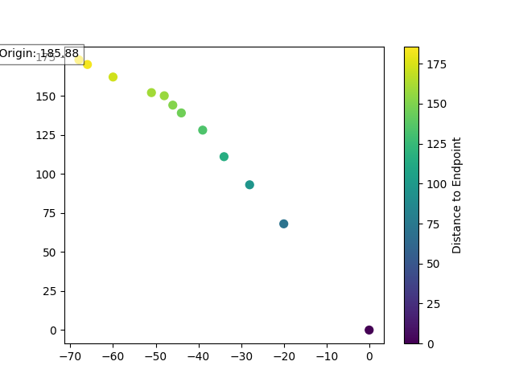
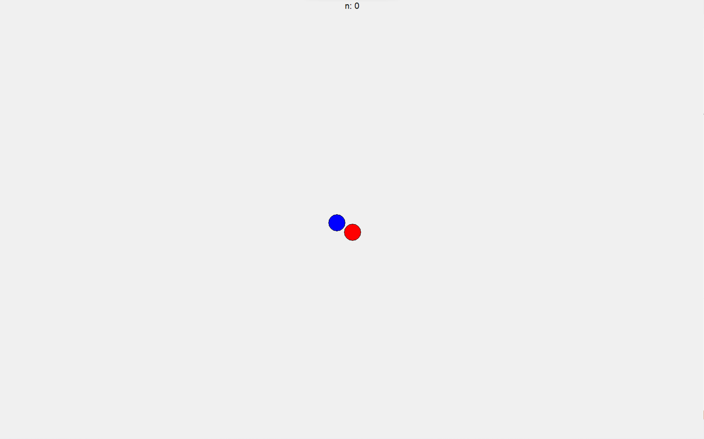
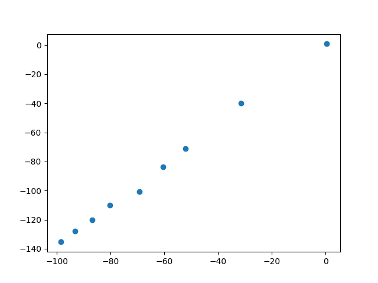

# mouse_control
一种基于神经网络来模拟人手移动鼠标的方法  
## 简介
本项目源于该死的轨迹检测。经过初步验证，本项目是有效的。  
  
上图为真人轨迹移动得到的散点图。这里我们用10个点来拟合轨迹。  
可以看到，人手的移动其实和pid，以及其他的曲线是有一定区别的。  
因此，我们选用神经网络来拟合真人鼠标移动轨迹。  
该神经网络其实很简单，只有三个全连接层。  
输入为目标距离当前位置的dx，dy。  
输出为10个点用来模拟真人的轨迹。  
## 收集鼠标轨迹
首先运行collect_data.py。运行后，我们会看到这样一个界面。  
  
我们需要点击红球，就会开始记录鼠标轨迹，点击蓝球，结束记录。这样我们就成功收集到一条鼠标轨迹的数据。  
重复这样，每收集100次程序会退出。我们一共要收集约300条数据。  
这样，我们就收集好了数据。  
## 划分数据集（可选）
我们将mouse_data.csv用vscode打开，选择一些数据剪切到mouse_data_test.csv中。  
## 训练模型
运行train.py，程序就会开始训练模型。最终我们能看到控制台打印出的一条test数据。是一个dx，dy拟合出的十个点。  
## 验证
  
我们将刚刚得到的十个点放到show.py中，观察散点图，发现其轨迹类似于本人鼠标移动轨迹。  
## todo
使用onnxruntime在c++上进行推理
